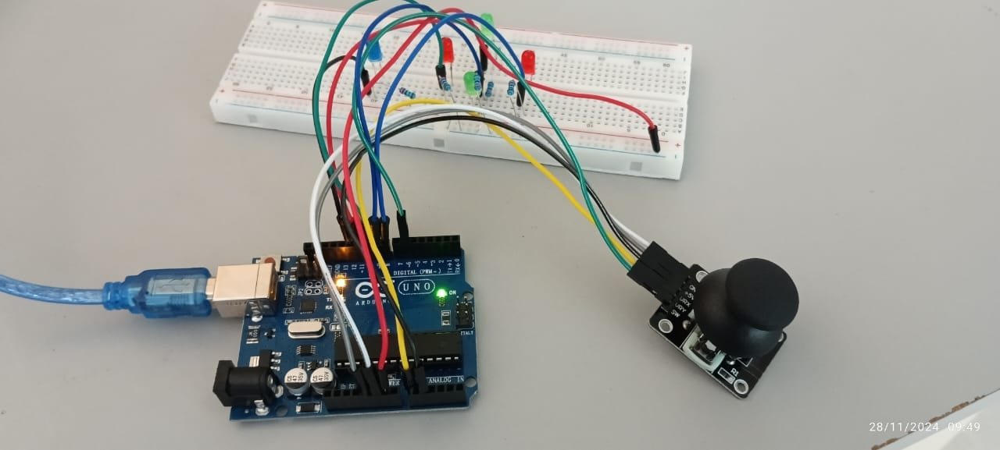
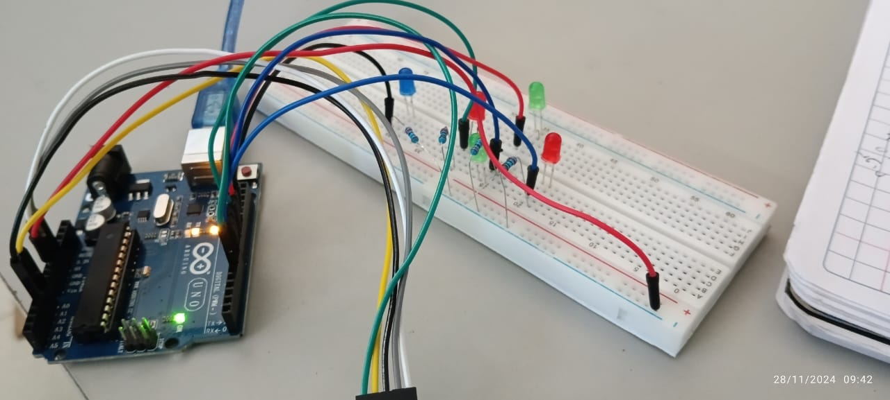
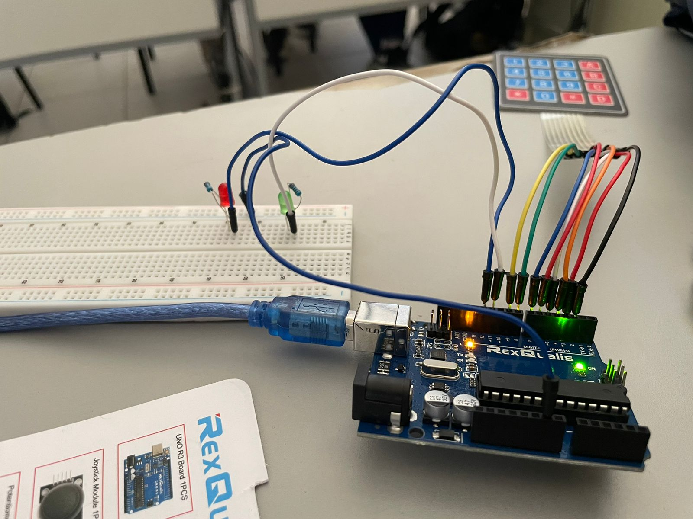
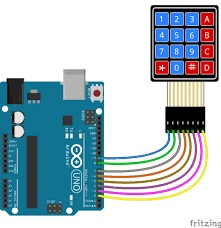
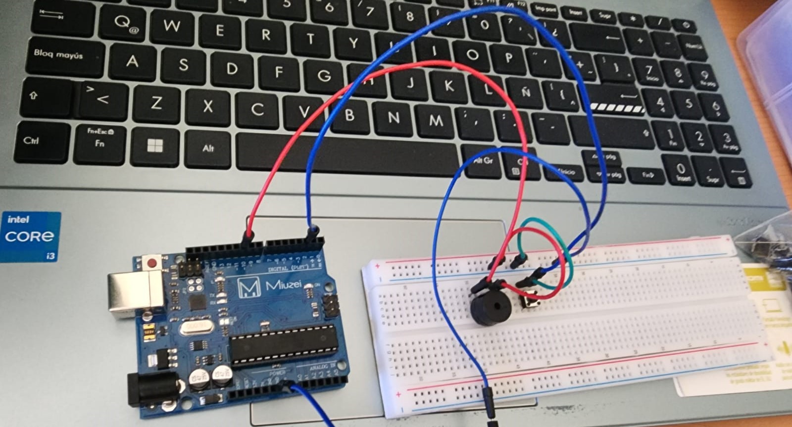

# IoT-Codes-Arduino-Expo
Contiene las exposiciones vistas en clases.

## Pantalla 7 segmentos
### Practica:
* 

### Componentes:
### Conexiones:

## Joystick
### Practica:
* 

### Componentes:
### Conexiones:

## Botones y leds
### Practica:
* 

### Componentes:
### Conexiones:

## Teclado membrana
### Practica:
* 

### Componentes:
### Conexiones:

## Servo motor
### Practica:
* 

### Componentes:
### Conexiones:

## Buzzer
### Practica:
* 

### Componentes:
### Conexiones:
